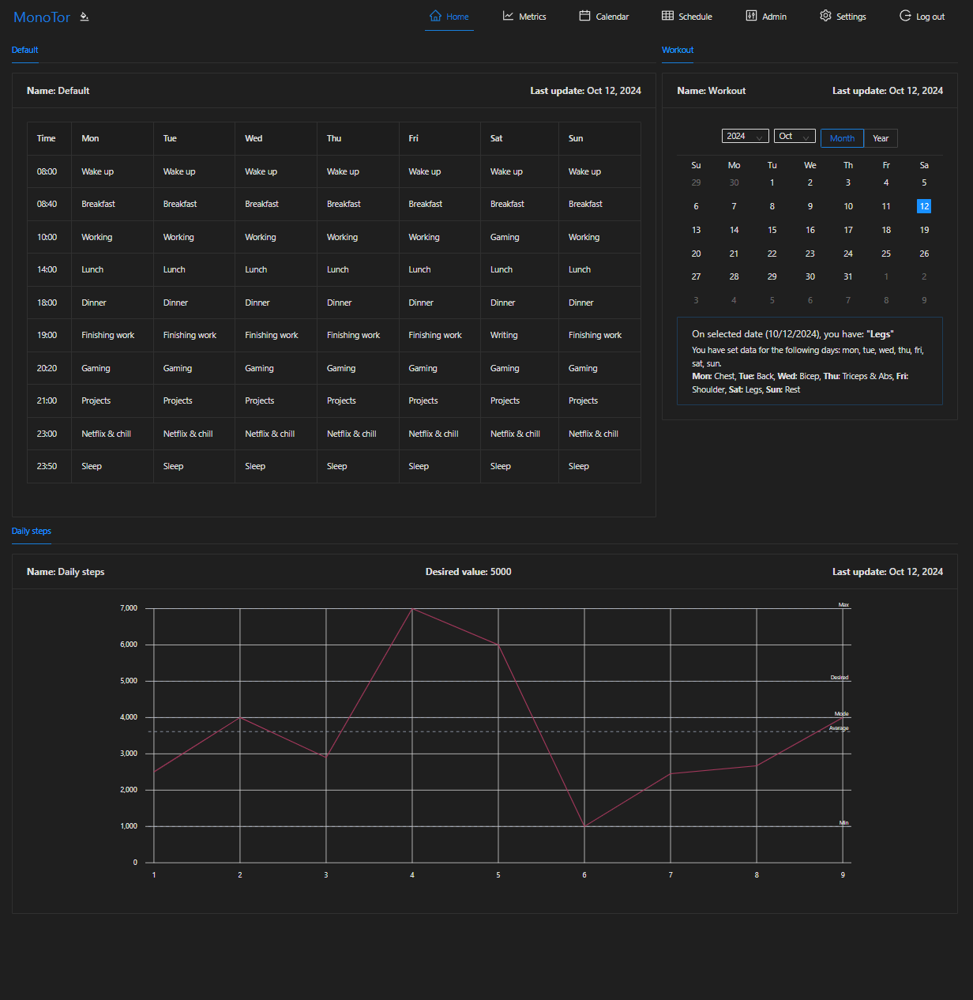
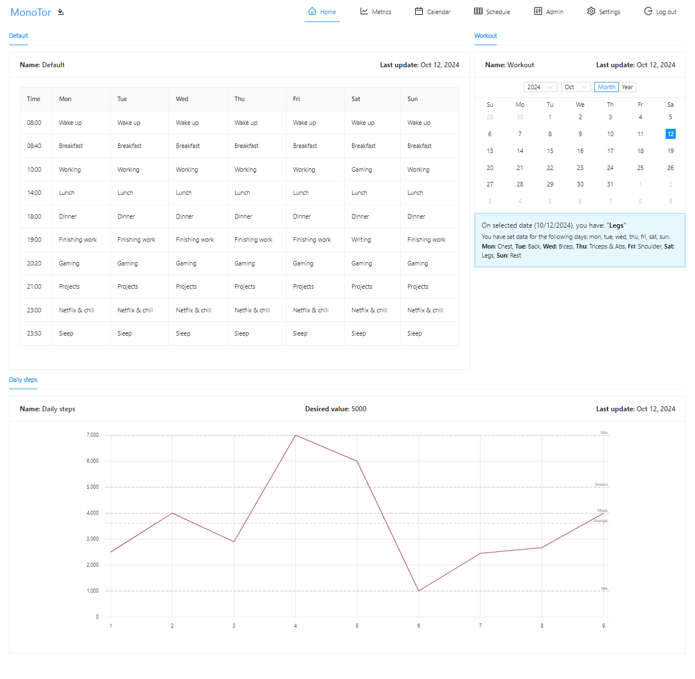
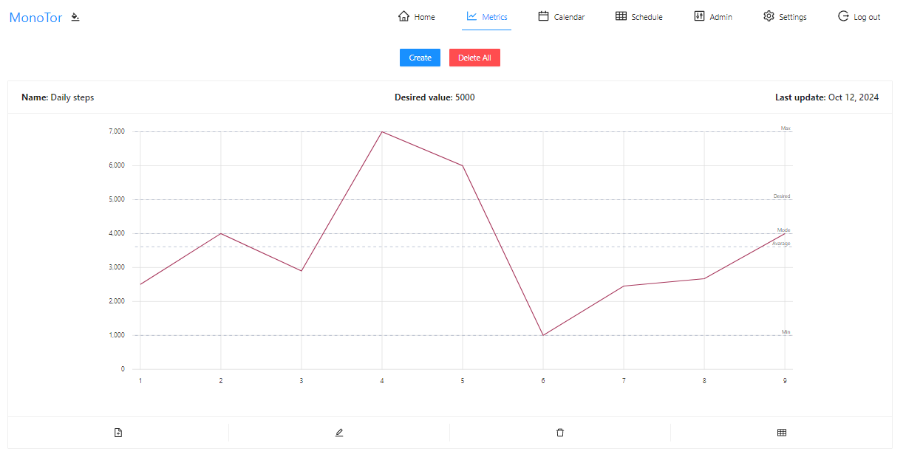
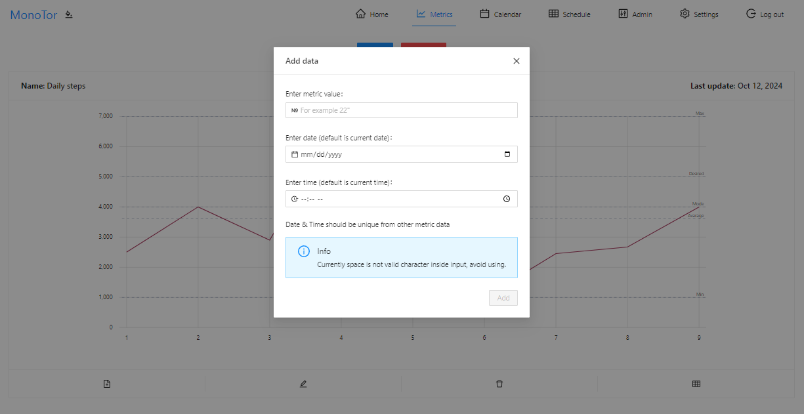
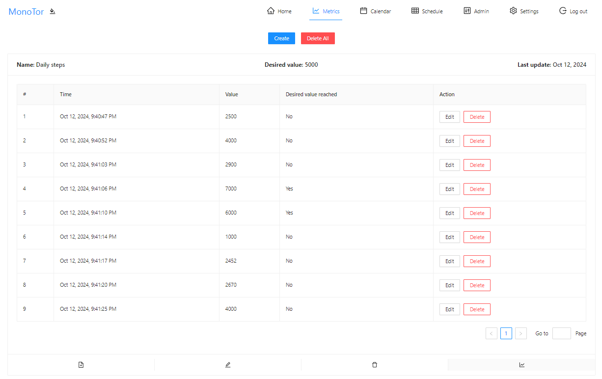
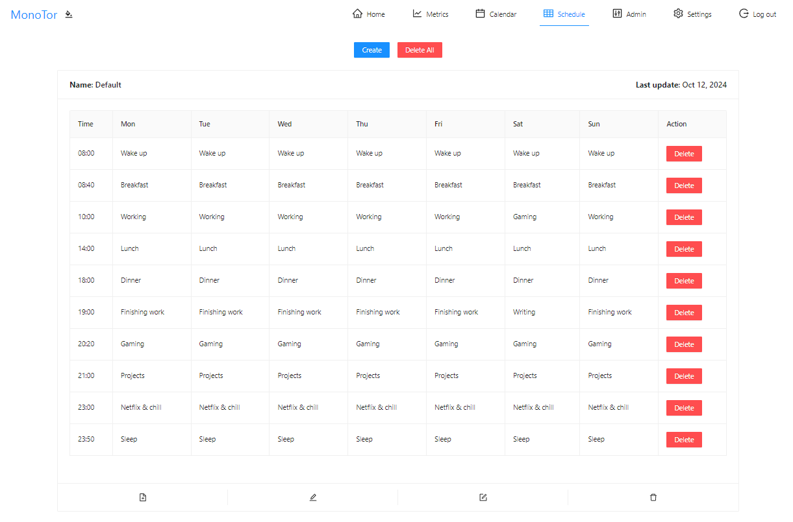
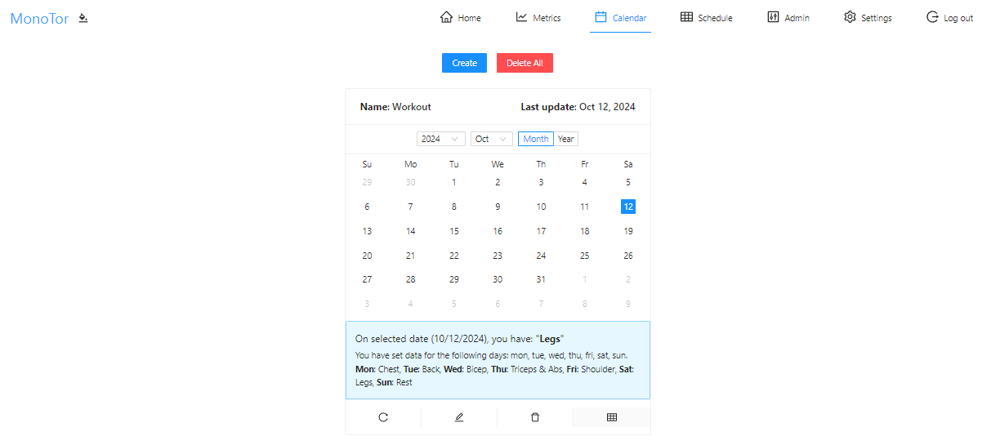
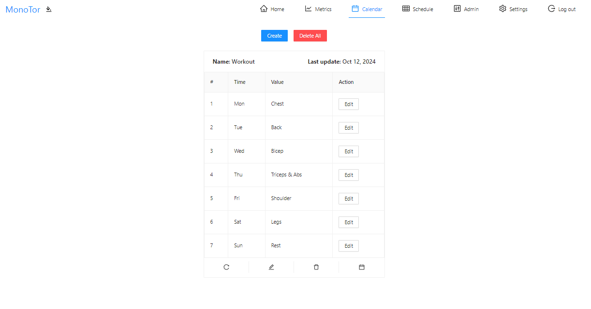
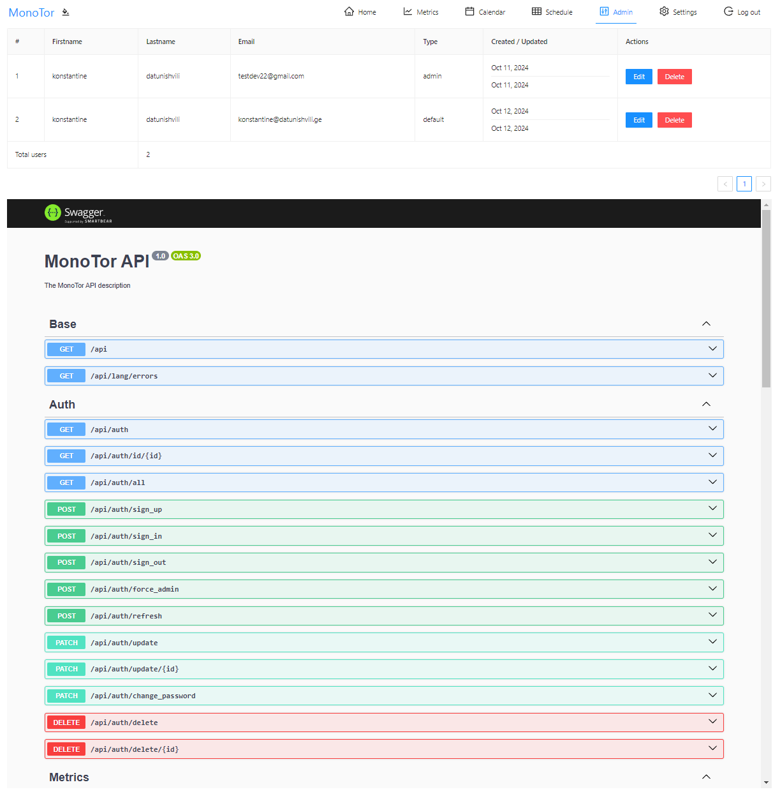

<!-- TOOD: add img -->

Monotor: Open-Source monitoring application.

<h2>Table of contents</h2>

- [Introduction](#introduction)
- [Features](#features)
- [Demo](#demo)
- [Getting started](#getting-started)
  - [Prerequisites](#prerequisites)
- [How to set up](#how-to-set-up)
  - [Docker compose](#docker-compose)
- [Usage](#usage)
- [Screenshots](#screenshots)
- [Contributing](#contributing)

## Introduction

Monotor is a self-hosted application for data monitoring. Initially, the application was designed to be a fitness tracker, but eventually, it became more dynamic, allowing users to create any type of data they want. It could be used for fitness, diet, learning, working, or adding any other type of data.

## Features

- Role-based authorization
- Generic data display:
  - Chart
    - Desired value reached
    - Mode
    - Avarage
    - Min / Max
  - Calendar
  - Table
- Admin / Settings panel
- Light / Dark theme
- Mobile application (as a PWA)
- Data backup (coming soon)

## Demo

If you want to try MonoTor, a demo is available at [IT_WILL_BE_ADDED_LATER].

## Getting started

See instructions to run MonoTor below.

### Prerequisites

- [Docker](https://www.docker.com/)

## How to set up

The application can be easily set up using Docker Compose.

### Docker compose

```
TODO: add
```

## Usage

Just open the browser and type `ip:port` of the machine running MonoTor.
First user who registers will be admin role.

### Force admin

If you forget password for admin user, you can force server to give you admin permission if it was enabled in `.env` configuration.

Open webiste create new user (this time remember password 🤷‍♂️) and write following code:

```js
sessionStorage.IDDQD = true;
```

After writing this code refresh website and your new user will have admin permission. From new user you can set new password on old user.

## Screenshots

Check more images inside the [screenshots](https://github.com/KostaD02/monotor/tree/main/screenshots).











## Project Architecture

The application is built using the [Nx](https://nx.dev/).

- Client side:
  - [Angular](https://angular.dev/)
  - [Ant Design](https://ng.ant.design/docs/introduce/en)
  - [Ngx Charts](https://www.npmjs.com/package/@swimlane/ngx-charts)
- Server side:
  - [Nestjs](https://nestjs.com/)
  - [Mongodb](https://www.mongodb.com/)

## Contributing

I will add new features when I have time, but you don't have to wait feel free to add them yourself! Fork the project and submit pull requests.

Check more details at [contributing page](https://github.com/KostaD02/monotor/blob/main/CONTRIBUTING.md).

# To Do

Here are a few ideas that will be implemented in the future. You can also open an issue for any of these ideas.

- Dockerize
- Backup support
- i18n - translations
- Notifications
- Write unit tests
- Extract folder structure
